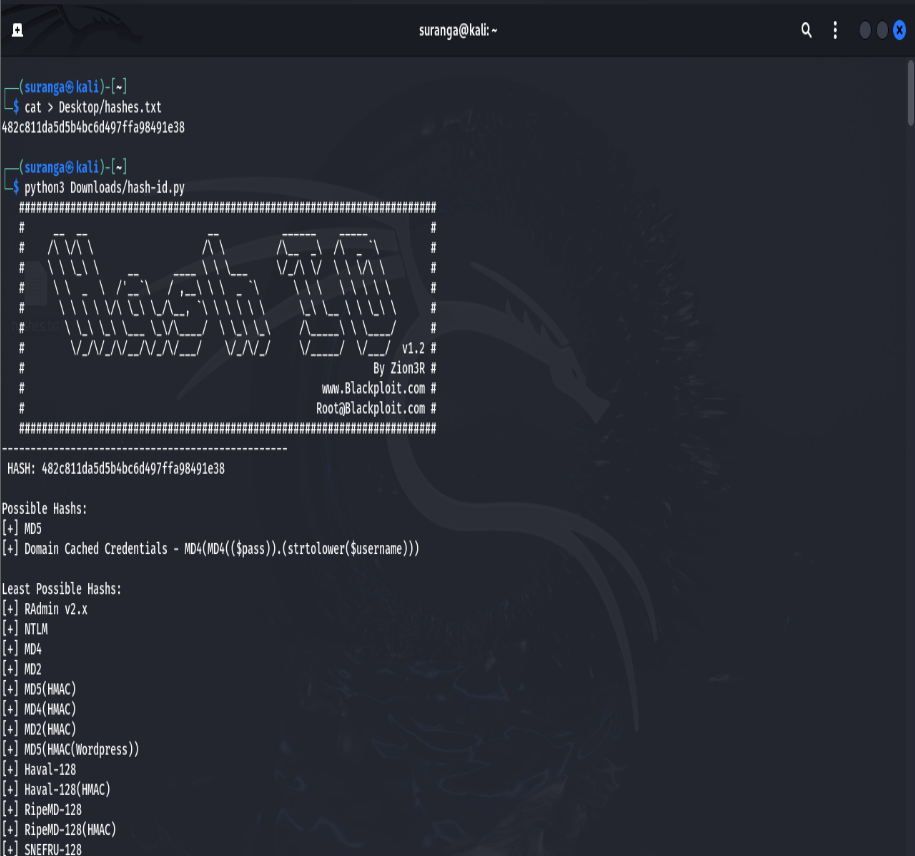
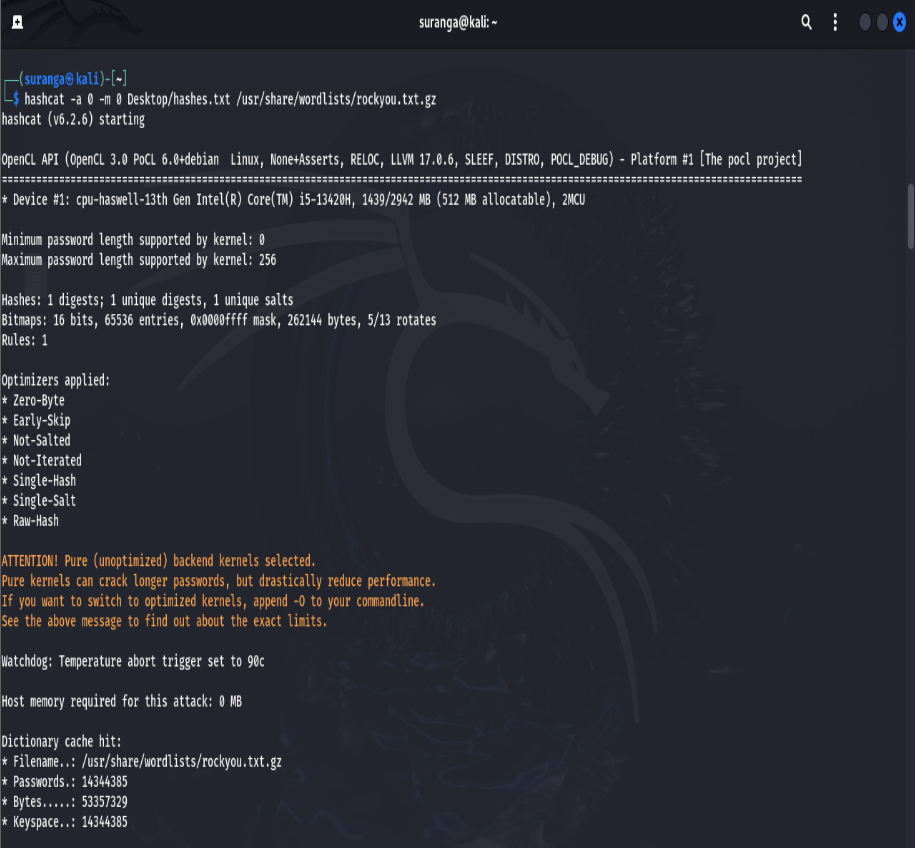
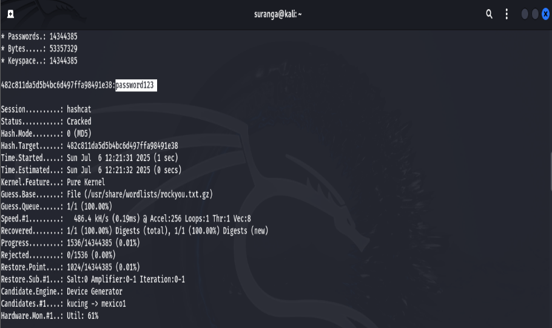

# Password Hash Analysis using Hashcat

Password hash identification and password auditing performed in Kali Linux using Hashcat, Hash-ID, and the RockYou wordlist.

## Tools
* Kali Linux
* Hashcat
* Hash-ID
* RockYou Wordlist

## Activities
* Identified hash types using Hash-ID.
* Configured Hashcat with the appropriate hash mode.
* Performed dictionary-based password auditing.
* Analyzed password recovery results and security implications.

## Evidence

### Hash Identification

### Hashcat Execution

### Password Recovery

## Skills Demonstrated
* Password Security
* Hash Analysis
* Hashcat
* Linux
* Security Assessment
* Cybersecurity Documentation

## Disclaimer
Activities were performed in a controlled laboratory environment for educational purposes only.
